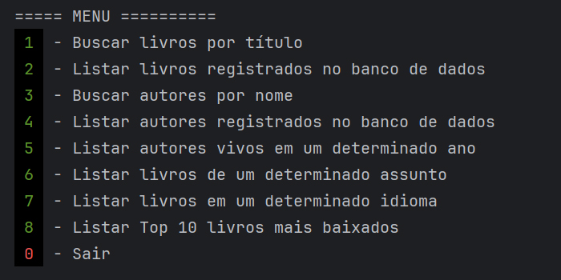
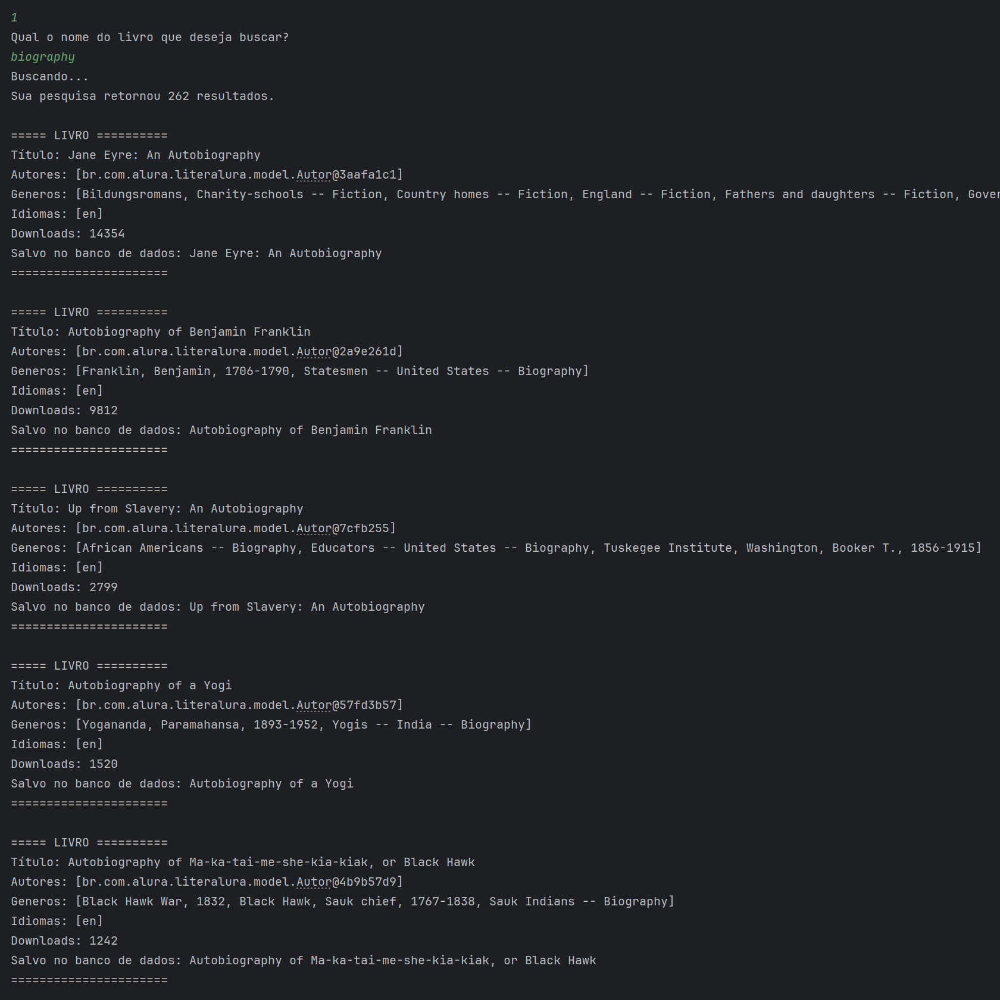

# LiterAlura

Desafio do ONE (Oracle Next Education). 
Um catálogo de livros em Spring Boot com Java. 

### OBJETIVO:
Desenvolver um Catálogo de Livros que ofereça interação textual (via console) com os usuários, proporcionando no mínimo 5 opções de interação. 
Os livros serão buscados através de uma API específica. 

## Menu de opções

## Classes

- ### Modelos
  - `Livro` 
  Contém todas as informações de livros retornadas pela API, como o seu `título`, lista de `autores`, lista de `gêneros`, lista de `idiomas`, e número de `downloads`.
  - `Autor` 
  Contém todas as informações de Autores retornadas pela API, como o seu `nome`, ano de `nascimento`, e ano de `falecimento`.

- ### Repositórios @Repository
  - `interface LivroRepository` 
   Contém as funções `Optional<Livro> findByTituloContainingIgnoreCase(String nome)` que busca um livro no banco de dados pelo valor do seu título, 
   `List<Livro> findByAssunto(@Param("assunto") String assunto)` que retorna uma lista de livros de um determinado assunto/gênero,
   e `List<Livro> findByIdioma(@Param("idioma") String idioma)` que busca uma lista de livros escritos em um específico idioma.
  - `interface AutorRepository` 
   Contém as funções `Optional<Autor> findDistinctByNomeContainingIgnoreCase(String nome)` que busca um autor no banco de dados pelo seu nome, 
   e `List<Autor> findAutoresVivosPorAno(@Param("ano") int ano)` que busca uma lista de autores vivos em um ano específico.
  - `record Repositories` 
  Utilizado para armazenar `LivroRepository` e `AutorRepository` em uma única variável.

- ### Serviços @Service
  - `class LivroService` 
  Contém as funções `Optional<Livro> findLivroPorNome(String nome)` que busca um livro no banco de dados pelo valor do seu título,
  `List<Livro> findLivrosPorAssunto(String assunto)` que retorna uma lista de livros de um determinado assunto/gênero,
  e `List<Livro> findLivrosPorIdioma(String idioma)` que busca uma lista de livros escritos em um específico idioma.
  - `class AutorService` 
  Contém as funções `Optional<Autor> findAutorPorNome(String nome)` que busca um autor no banco de dados pelo seu nome,
  e `List<Autor> findAutoresPorAno(int ano)` que busca uma lista de autores vivos em um ano específico.
  - `record Services` 
  Utilizado para armazenar `LivroService` e `AutorService` em uma única variável.

- ### Utilidades
  - `class Menu` 
  Contém diversas funções estáticas para geração e exibição de menus e elementos de texto no terminal da aplicação.
  - `class API` 
  Contém as funções estáticas `String buscarDados(String uri)` que se conecta a uma API e retorna o conteúdo, 
  e `<T> T converteJSON(String json, Class<T> classe)` que converte o conteúdo json retornado pela API em uma classe Java.
  - `class Database` 
  Contém o método estático `void adicionar(Object obj)` responsável por adicionar o conteúdo de um `Livro` ou `Autor` retornado pela API na base de dados.

